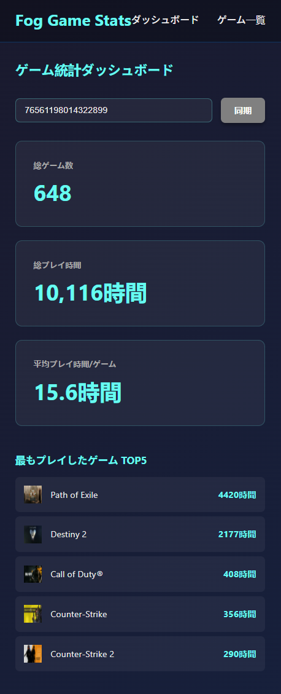
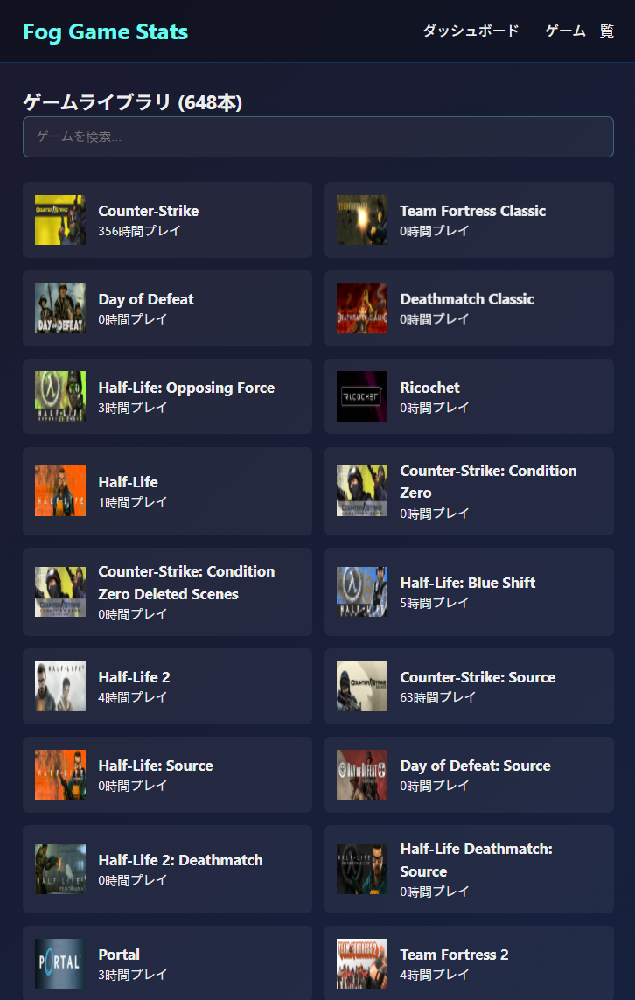
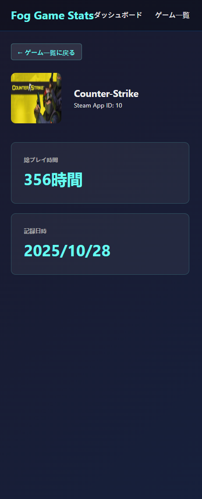
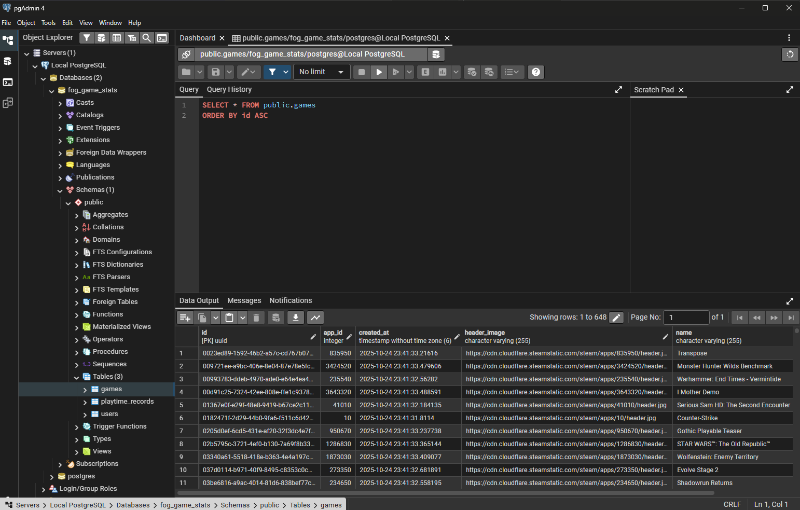

# Fog Game Stats

Steam のゲームライブラリとプレイ時間統計を追跡・可視化するフルスタックWebアプリケーション。
Steam Web API からゲームデータを取得し、PostgreSQL データベースに保存して、直感的なダッシュボードで統計情報を表示します。

---

##  機能

-  **ダッシュボード**: 総ゲーム数、総プレイ時間、平均プレイ時間を表示
-  **ゲームライブラリ**: 所有する全ゲームを検索可能な一覧で表示
-  **ゲーム詳細**: 個別ゲームのプレイ時間と統計情報
-  **Steam同期**: Steam Web API から最新データを取得
-  **複数ユーザー対応**: 異なる Steam ID のデータを閲覧可能

---

##  技術スタック

### バックエンド
- **Java 21**
- **Spring Boot 3.x** - REST API フレームワーク
- **PostgreSQL** - データベース
- **Spring Data JPA** - ORM
- **WebClient** - Steam Web API との通信

### フロントエンド
- **React 18** - UI ライブラリ
- **Vite** - ビルドツール
- **React Router v6** - ルーティング
- **Axios** - HTTP クライアント
- **CSS Modules** - スタイリング

### 外部API
- **Steam Web API** - ゲームデータとプレイ時間の取得

---
##  スクリーンショット

### ダッシュボード

### ゲームライブラリ

### ゲーム詳細

### データベース構造

---
